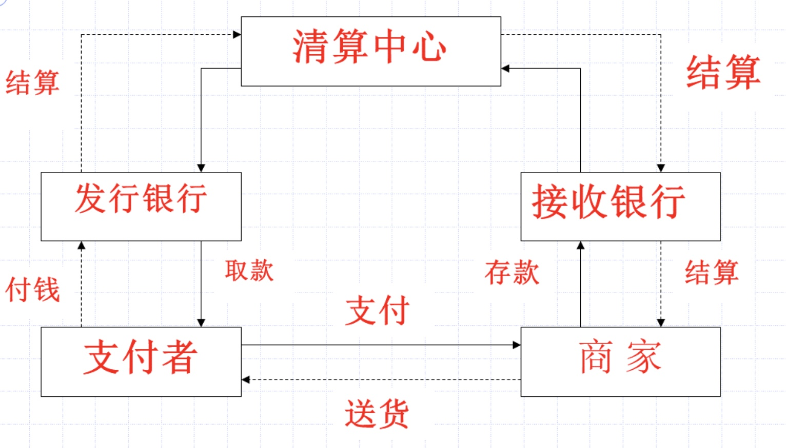

# 信息安全与密码学

## 绪论

### 网络基本结构

#### ==OSI参考模型==

1. 物理层

2. 数据连接层

3. 网络层

4. 传输层

5. 会话层

6. 表示层

7. 应用层

   ---

#### TCP/IP协议

==参考模型==（四个层次）

1. 网络接口层

   + 最底层协议
   + 网络接口一般是设备驱动
   + 与OSI关系
     + 物理层
     + 数据连接层
     + 网络层中==与子网有关的下部子层==

2. 网络层（IP）

   + 定义数据包格式
   + 与OSI关系
     + 等价于网络层中==与通讯子网无关的部分==

3. 传输层（TCP)

   + 负责提供两个用户进程间的通讯
   + 与OSI关系
     + 传输层

4. 应用层

   + 提供一组常用的应用程序

   + 与OSI关系

     + 会话层
     + 表示层
     + 应用层

     ---

   + 应用层协议

     1. FTP——文件传输协议
     2. Telnet——虚拟终端服务协议
     3. SMTP——简单邮件传输协议
     4. HTTP——超文本传输协议

---

#### 信息系统

==信息系统七层结构==

| 层号 | 名称   | 说明             |
| ---- | ------ | ---------------- |
| 1    | 用户层 | 用户面向对象操作 |
| 2    | 业务层 | 信息系统业务模型 |
| 3    | 功能层 | 信息系统功能模型 |
| 4    | 数据层 | 信息系统数据模型 |
| 5    | 工具层 | 信息系统开发工具 |
| 6    | OS层   | 网络操作系统     |
| 7    | 物理层 | 网络与通信硬件   |

==系统分析==从第1层开始，由上到下直至第7层结束。

==系统设计==和==实现==是从第七层开始，由下到上直至第一层结束。

---

### 信息安全

1. 密码技术和防火墙技术
2. 入侵检测技术
3. 网络安全
4. 数据库和操作系统安全
5. 计算机病毒及防治
6. 信息安全标准信息
7. 信息系统安全评估

## 密码学

### 密码学基本概念

> 密码学是研究==密码系统==和==通讯安全保密==的学科。

+ 密码编码学

  研究如何产生安全性高的==密码算==法==和协议==，保证信息的==保密性==和==认证性==

+ 密码分析学

  研究密码的破译会对认证消息进行伪造，以窃取机密信息。

二者相互独立相互促进

---

密码体制分类

+ ==对称密码体制==

  加密密钥和解密密钥==相同==或==彼此容易相互确定==

  + 优点

    加密和解密简洁、快速

  + 缺点

    N个用户使用对称密码进行通讯时，需要$C^2_N=N(N-1)/2$个密钥，使得密钥分发过于复杂。而且对称密码==难于实现数字签名==。

+ ==非对称密码体制==

  也称为公钥密码体制或双钥密码体制

  + 私钥保密

  + 公钥公开

  + 加密和解密算法公开

  + 用==公钥加密==，只有用与之相应的==私钥==才能==解密==

  + 优点

    密钥分配简单

  + 缺点

    加密解密算法的处理速度很慢

### 密码学数学基础

+ 最大公约数（辗转相除法）

  > ==$a=qb+r$，则$(a,b)=(b,r)$==
  >
  >  任意两个整数$a,b$存在最大公约数，且存在整数$s,t$ 使得$(a,b)=sa+tb$

+ 同余

  对于一个正整数m，如果整数a、b满足a-b被m整除，即$m|(a-b)$ ,则称整数a和b模m同余，记为$a\equiv b(modm)$。

  + 同余的性质
    1. 自反性：$a\equiv a(modm)$
    2. 对称性：如果$a\equiv b(modm)$,那么$b\equiv a(modm)$
    3. 传递性：如果$a\equiv b(modm)$_,_$b\equiv c(modm)$,那么$a\equiv c(modm)$。

+ 欧拉函数

  设m是一整数，则小于m的整数$0,1,...,m-1$ 中与m互素的整数个数称为欧拉函数，记为$\varphi(m)$ 。

  显然，当m为素数是$\varphi(m)=m-1$

  + 定理：设p、q是两个互素的整数，$n=pq$，则$\varphi(n)=\varphi(p)\varphi(q)$

+ 欧拉定理

  设$m>1$,且$gcd(a,m)=1$,则$a^{\varphi(m)}\equiv 1(modm)$

  ==$a*a^{\varphi(m)-1}(modm)\equiv a^{\varphi(m)}(modm)\equiv 1(modm)$ 所以$a^{\varphi(m)-1}mod(m)$ 是 $a(modm)$的乘法逆元。==

+ 利用拓展欧几里得方法求==乘法逆元==

  例子：

  
  
  ==利用矩阵求乘法逆元==

## 流密码

### 流密码基本概念

先将明文流m划分成字符，或其编码的基本单元（如0，1数字），然后利用密钥$k_i$(种子密钥)产生一个密钥流k与明文流m逐位的加密得到密文c，解密时以同步产生同样的密钥流k与密文流c逐位解密来恢复明文m。

+ 流密码的分类

  1. ==同步流密码==

     ---

     $\sigma_{i+1}=f(\sigma_i,k_I)$

     $k_i=g(\sigma_i,k_I)$

     $c_i=E(k_i,m_i)$

     $\sigma_i$是第i时刻密钥流生成器的内部状态

     $f$是状态转移函数

     $g$是密钥流生成函数

     $E$是组合密钥流$k_i$和明文$m_i$产生密文$c_i$的函数

     ---

  2. ==自同步流密码==

     密钥流的产生==与明密文有关==的流密码
  
     $c_i$不仅和当前的明文位$m_i$有关，而且==和已经产生的t个密文位有关==
  
     ---
     
     $\sigma_i=(c_{i-t},c_{i-t+1},…,c_{i-1})$
     
     $k_i=g(\sigma_i,k_I)$
     
     $c_i=E(k_i,m_i)$
     
     其中，$\sigma_0=(c_{-t},c_{-t+1},…,c_{-1})$ 是非秘密的初始状态，$k$是密钥，$g$是产生密钥流的函数，$E$是组合密钥流和明文流的加密函数。
     
     ---
     
     因为$\sigma_i$依赖于$k_i,\sigma_{i-1},m_i$所以密文$c_i$不仅与当前输入的明文$m_i$有关，而且==与$c_{i-1},…,c_{i-t}$有关==。

### 线性反馈移位寄存器序列（计算）

移位寄存器每次向右移动一位，新的最左边的级根据反馈函数得到，移位寄存器输出的级是最低位。

GF(2)上的n级反馈移位寄存器，包括**n个二元存储器**和**一个反馈函数$f$**

---

+ m序列

线性反馈移位寄存器输出序列的性质完全由反馈函数所决定。n级线性反馈移位寄存器最多有$2^n$种不同的状态，如果初始状态为0，那么后续状态恒为0。如果初始状态不为0，那么后续状态也不为0。所以n级线性反馈移位寄存器的状态周期最大为$2^n-1$,即输出序列的周期最大也为$2^n-1$。==周期达到$2^n-1$的序列称为m序列==。

+ ==m序列密码的破译==

设$S和S’$是m序列的线性移位寄存器两个连续的状态。

$S=\begin{bmatrix}a_1 \\ a_2 \\ \vdots \\ a_n\end{bmatrix},S'=\begin{bmatrix}a_2 \\ a_3 \\ \vdots \\ a_{n+1}\end{bmatrix}$

其中$a_{n+1}=c_1a_1\oplus c_2a_2\oplus …\oplus c_na_n$

---

表示为矩阵的形式：

$S’=MS$

$M=\begin{bmatrix} 0 & 1 &0&…&0\\0&0&1&…&0\\\vdots&\vdots&\vdots&\ddots&\\c_1&c_2&&\cdots&c_n \end{bmatrix}$

称矩阵M为特征多项式$f(x)$的伴侣矩阵，它==和$f(x)$是一一对应相互确定的==

----

如果已知一段长2n的明密文对，即已知：

$m=m_1m_2…m_{2n}$和$c=c_1c_2…c_{2n}$

于是可以求出密钥序列$k=k_1k_2…k_{2n}$,其中$k_i=m_i\oplus c_i=m_i\oplus (m_i\oplus k_i)$

由此可推出n+1个状态：

$S_1=\begin{bmatrix}k_1 \\ k_2 \\ \vdots \\ k_n\end{bmatrix},S_2=\begin{bmatrix}k_2 \\ k_3 \\ \vdots \\k_{n+1}\end{bmatrix},…,S_{n+1}=\begin{bmatrix}k_{n+1} \\ k_{n+2} \\ \vdots \\ k_{2n}\end{bmatrix}$

做矩阵

$X=(S_1,S_2,\cdots,S_n)^T$

$Y=(S_2,S_3,\cdots,S_{n+1})^T$

---

因为$S’=MS$,所以有：

$Y=MX$

因为X中的n个状态数线性无关的，所以X是满秩的，所以存在逆矩阵$X^{-1}$，于是：

$M=YX^{-1}$

## 分组密码

### 分组密码原理

将明文序列编码表示后的数字序列$m_0,m_1,…,m_i,...$划分成长为$l$的组$m=(m_0,m_1,…,m_{l-1})$,各组分别在密钥$k=(k_0,k_1,…,k_{l-1})$控制下变换成等长的输出数字序列$c=(c_0,c_1,…,c_{l-1})$,其加密函数E，$V_l\times K\rightarrow V_l$,$V_l$是l维矢量空间，K是密钥空间。

### 分组密码分类

+ 对称分组密码

+ 非对称分组密码

### 应用方面

+ 伪随机数生成器
+ 序列密码
+ 认证码和哈希函数

### 分组密码算法应满足的要求

+ **分组的长度n要==足够大==**
+ **密钥量要==足够大==**
+ **由密钥确定置换的算法要==足够复杂==**
+ **加密解密运算==简单==**
+ **数据扩展==尽可能小==**
+ **差错传播==尽可能小==**

### 分组密码与流密码区别

+ 流密码的强度完全依赖与密钥流生成器所产生的序列的随机性和不可预测性，其==核心问题==是==流密钥生成器==的设计。

+ 分组密码的常用shannon所提出的迭代密码体制，即把一个==密码强度较弱的函数==经过==多次迭代==后获得较强的密码函数。

  每次迭代称为一轮，每一轮的子密钥都不同，都是由主密钥控制下的==密钥编排算法而得到的==。加密函数重复使用了替代和置换两种基本的加密变换。

  另外，在基本加密算法前后，还要进行位移和扩展。

### Feistel密码结构

假设加密过程的输入为分组长$2w$的明文和一个密钥K（K在运算过程中将分成多个子密钥$K_i$），将明文分为两部分，左边记为$L_0$，右边记为$R_0$。

以下是加密过程图：

$L_i=R_{i-1} , R_i=L_{i-1}\oplus f(R_{i-1},K_i)$

+ ==Feistel网络的参数和设计特点==
  1. 分组的大小：分组越大意味着安全性越高，加解密速度就越慢
  2. 密钥大小：密钥长度越长则安全性越高，加解密速度就越慢
  3. 循环次数：循环越多安全性越高，通常采用16次
  4. 子密钥产生算法：这个算法越复杂，则密码分析就困难
  5. round函数（轮函数）：round函数越复杂抗击密码分析的能力就越强

### 数据加密标准DES（分析）

+ 明文和密文分组长度为64bit
+ 算法包含两个部分：==迭代加解密==和==密钥编排(拓展)==
+ Feistel结构：加密和解密除==密钥编排不同==外，完全相同
+ 密钥长度：56bit，每7bit后为一个校验位，共64bit
+ 轮函数采用混淆和扩散的组合，共16轮

---

+ 算法结构：

---

+ 算法步骤：

  1. 给定明文，通过一个固定的初始IP置换来重新排列输入明文块P中的比特，得到比特串$p_0=IP(P)L_0R_0$，这里$L_0和R_0$是$P_0$的前32比特和后32比特。

  2. 根据下述规则进行16次迭代，即：

     $i\in [1,16]$

     $R_i=L_{i-1}\oplus f(R_{i-1},K_i)$

     f是一个函数（轮函数）

     16个长度为48bit 的自密钥$K_i(1\le i\le 16)$是由密钥K经过密钥编排函数计算出来的

  3. 对比特串$R_{16}L_{16}$使用逆置换$IP^{-1}$得到密文C，即：$C=IP^{-1}(R_{16}L_{16})$==注意$R_{16}L_{16}$的顺序是相反的==。

---

+ 轮函数f

  轮函数$f(R_{i-1},K_i)$第一个输入为32bit的$R_{i-1}$,第二个驶入为48bit的$K_i$，输出结果是32bit

  ==E拓展==：$R_{i-1}$根据拓展选择表的规则由32bit拓展成48bit

  ==S盒代换==：

  1. $E(R_{i-1})\oplus K_i$之后，将结果分成8个长度为6bit的比特串，记为：$B=B_1B_2B_3B_4B_5B_6B_7B_8$

  2. 使用8个S盒$S_1,S_2,S_3,S_4,S_5,S_6,S_7,S_8$。每一个$S_i$是一个固定的4*16阶的矩阵，它的元素来自0到15这16个整数。

     给定一个长度为6的比特串，$B_j=b_1b_2b_3b_4b_5b_6$，我们按照$S(B_j)$计算

     $S_j(B_j)$:

     1. 用$b_1b_6$对应的整数$r（r=0，1，2，3）$来确定$S_i$的行
     2. 用四个比特$b_2b_3b_4b_5$对应的整数$c$$（0\le c\le15）$来确定S盒的列
     3. $C_i=S_j(B_j)$的取值是$S_j$的第r行第c列的整数==对应的4位二进制表示==

  ==P置换==：将长度为32bit的比特串$C=C_1C_2C_3C_4C_5C_6C_7C_8$通过一个固定的置换——==P置换==

  P(C)记为$f(R_{i-1},K_i)$

  ---

  算法结构：

  

  ---

+ DES密钥拓展算法

  每一轮都使用不同的从初始密钥$K$导出的48bit密钥$K_i$。

  K是一个长度为64的比特串，实际上它只有56位，在第8，16，24，32，…，64位为==校验比特==。

  **轮密钥计算中不考虑校验比特**。

  轮密钥计算方法：

  1. 给定一个64比特的密钥K，删掉8个校验比特并利用一个固定==置换PC-1==置换K的剩下56 bit，记为：==$PC-1(K)=C_0D_0$==，这里$C_0$是左28 bit，$D_0$是右28 bit。

  2. 对每个$i,1\le i \le 16$,计算：

     $C_i=LS_i(C_{i-1})$

     $D_i=LS_i(D_{i-1})$

     $LS_i$表示左移位：

     

     当$i=1,2,9,16$时，==$LS_i$左移一位==

     当$i=3,4,5,6,7,8,10,11,12,13,14,15$时，==$LS_i$左移两位==。

  3. 得到$C_i(28bit)和D_i(28bit)$组合成$C_iD_i(56bit)$进行==PC-2置换==，记为$K_i=PC-2(C_iD_i)$

  PC-1置换：

  

  PC-2置换：
  
  

---

+ DES解密算法

  解密采用同一算法实现，把密文$y$作为输入，使用$K_{16},K_{15},…,K_1$的密钥顺序，输出将是明文$x$。

+ **==DES安全性分析==**

  1. S盒的设计：

     S-盒是DES算法的核心模块，DES靠它实现==非线性变换==

     1976年，NSA披露S-盒的几条设计准则：

     1. 每个S-盒的每一行是整数0到15的一个置换
     2. S-盒的每一个输出都不是它的输入的线性或仿射函数
     3. 改变S-盒的一个输入比特，其输出至少有两比特产生变化
     4. 对任何S-盒和任何输入x，$S(x)$和$S(x \oplus 001100)$至少有两比特不同
     5. 对任何S-盒和任何输入x，以及$e,f \in \{0,1\}$,$S(x)\ne S(x\oplus 11ef00)$，其中x为长度为6的比特串
     6. 对任何S-盒，当它的任意输入位保持不变，其他5位输入变化时，输出数字中的0和1的总数接近

### 高级加密标准AES（分析）

+ AES算法的==整体结构==

  1. AES的加解密算法、密钥生成算法都是以==状态矩阵==为输入

     AES首先将明文按字节分成列组：

     

  2. 加密时，==首先==进行”轮密钥加“算法

     然后重复9轮==基本密码模块==的算法，包括==字节代换==，==行移位==，==列混淆==，==轮密钥加==

     最后，==第10轮==运算，它与前9轮不同的是**==少了列混淆算法==**

  3. 解密时，执行加密的逆过程。==字节代换==、==行移位==、==列混淆==三种算法是==执行逆过程==，算法设计完全不同，只有轮密钥加算法和加密时相同。

  

  ---

+ AES的==轮函数==

  1. 字节代换（ByteSub）：

     128bit的比特串可以看成==16个字节==

     对于每一个字节，==前四位==指定S盒的行，==后四位==指定S盒的列

     由行和列所确定的S盒位置上的元素取代了明文矩阵中相应位置的元素

     ---

     字节变换是非线性变换，独立地对状态的每个字节进行代换，代换表是可逆的，由以下==两个变换合成==得到：

     1. 将字节看做GF($2^8$)上的元素，映射到自己的==乘法逆元==，00映射到自己

     2. 对字节做如下（$GF(2^8)$上的）仿射变换

        $\begin{pmatrix}b_0\\ b_1\\ b_2 \\b_3\\ b_4 \\ b_5\\ b_6 \\ b_7\end{pmatrix}=\begin{pmatrix}1&0&0&0&1&1&1&1\\ 1&1&0&0&0&1&1&1 \\ 1&1&1&0&0&0&1&1 \\ 1&1&1&1&0&0&0&1 \\ 1&1&1&1&1&0&0&0 \\ 0&1&1&1&1&1&0&0 \\ 0&0&1&1&1&1&1&0 \\ 0&0&0&1&1&1&1&1 \end{pmatrix}\begin{pmatrix}a_0\\ a_1\\ a_2 \\a_3\\ a_4 \\ a_5\\ a_6 \\ a_7\end{pmatrix}^{-1}+\begin{pmatrix} 1 \\1\\0\\0\\0\\1\\1\\0\end{pmatrix}$

        ---

  2. 行移位（ShiftRow）：将状态矩阵的各行进行循环移位，不同状态行的==位移量==不同。

     

     

     ---

  3. 列混淆（MixColumn)：将状态阵列的每个列视为$GF(2^8)$上的多项式

     $s’_j(x)=a(x)\otimes s_j(x),0\le j\le3$

     其中$a(x)=\{03\}x^3+\{01\}x^2+\{01\}x+\{02\}$，$\otimes$表示模$x^4+1$乘法。

     ---

     矩阵形式：

     

     ---

  4. 轮密钥加（AddRoundKey）：将状态矩阵与==轮密钥==进行逐比特异或。轮密钥由中子密钥通过==密钥编排算法==得到。

     

     ---

+ AES密钥编排算法

  1. 密钥拓展

     首先将128bit的密钥按矩阵的咧进行分组

     | $k_{00}$ | $k_{01}$ | $k_{02}$ | $k_{03}$ |
     | -------- | -------- | -------- | -------- |
     | $k_{10}$ | $k_{11}$ | $k_{12}$ | $k_{13}$ |
     | $k_{20}$ | $k_{21}$ | $k_{22}$ | $k_{23}$ |
     | $k_{30}$ | $k_{31}$ | $k_{32}$ | $k_{33}$ |

     添加40个新列来进行扩充：

     如果==i不是4的倍数==：

     $W(i)=W(i-4)\oplus W(i-1)$

     如果==i是4的倍数==：

     $W(i)=W(i-4)\oplus T[W(i-1)]$

     ---

     $T[W(i-1)]$的实现方式：

     1. 字循环：将1个字中的4个字节循环左移1个字节。

        即将输入字[b0, b1, b2, b3]变换成[b1,b2,b3,b0]。

     2. b.字节代换：对字循环的结果使用S盒进行字节代换。

     3. 轮常量异或：将前两步的结果同轮常量$Rcon[j]$进行异或，其中j表示轮数。

        

     ---

  2. 轮密钥选取

     

+ AES解密算法

  1. ByteSub的逆变换由代换表==逆表==做字节代换

  2. 行移位运算的逆变换是==循环右移==，位移量与左移相等

  3. 列混淆每列都用特定多项式$d(x)$相乘

     $d(x)=0Bx^3+0Dx^2+09x+0E$

  4. 密钥加逆运算等与自身

### DES和AES

+ 相同点
  + 轮函数都是由四层结构构成（==非线性层==、==移位层==、==线性混合层==、==子密钥异或==）只是顺序不同
  + AES中的非线性运算==字节代替==，对应于DES中的S-盒
  + ==行移位==运算保证了每一行的字节不仅仅影响==其他行对应字节==，而且影响==其他行所有字节==，这与DES中==置换P==类似
  + AES算法的==列混淆==目的是让不同的字节相互影响，与DES结构中的==$R_i=L_{i-1}\oplus f(R_{i-1},K_i)$==效果类似
  + 二者都存在子密钥异或的步骤
+ 不同点
  + AES密钥长度是可变的，DES密钥长度固定56位（加上8个校验位，共64位）
  + DES是比特运算，AES是字节运算
  + AES加密运算和解密运算==不一致==，因此加密器和解密器不同；==DES加密器可用作解密器==，只是密钥的顺序不同

## 公钥密码体制

### 参数生成过程

1. 信息接收者产生一堆用来加密解密的密钥==（$PK,SK$）==，其中PK是公钥，SK是私钥
2. 将加密密钥PK公开，私钥SK保密

### 加解密过程

1. B向A发送消息M，则使用A的公开密钥PK加密M，==$C=E(M,PK_A)$==

   其中C是密文，E是加密算法

2. A收到密文C之后，用自己的私钥$SK_A$解密，表示为==$M=D(C,SK_A)$==

   其中D是解密算法

### 参数生成需满足的需求

1. 产生密钥对PK，SK在==计算上==是容易的
2. ==$C=E(M,PK)$==，在计算上是容易的
3. ==$M=D(C,SK)$==，在计算上是容易的
4. 由公钥PK求私钥SK是不可行的
5. 由密文C和公钥PK==恢复明文M==和==求解私钥SK==在计算上时不可行的

---

*根据上述条件实质上是要构造一个==陷门单向函数==*

---

+ 单向陷门函数
  1. 给定x，计算$y=f_k(x)$是容易的
  2. 给定y，计算$x=f_k^{-1}(y)$不可行
  3. 当k已知时，对给定的任何y，若相应的x存在，则计算x使得$x=f_k^{-1}(y)$是容易的

### RSA公钥密码体制（计算）

RSA的理论基础是数论的欧拉定理，它的安全性依赖于==大整数的素因子分解==的困难性

> 欧拉定理：若整数a和n互素，则$a^{\varphi(n)}\equiv1(modn)$

+ RSA算法密钥对生成：

  1. 选取两个大素数p和q，两个数==长度接近==且==相差较大==
  2. 计算$n=p*q,\varphi(n)=(p-1)*(q-1)$
  3. 随机选取整数e，$1<e<\varphi(n)$，满足$gcd(e,\varphi(n))=1$
  4. 计算d，d为e模$\varphi(n)$的乘法逆元，$d*e\equiv 1(mod\varphi(n))$

  ==e和n为公钥==，==d为私钥==

+ RSA加解密算方法：

  现将明文比特串分组，是每个分组对应的十进制数==小于n==。然后对每个分组明文m，做加解密运算：

  加密：$c=E(m,e,n)\equiv m^e(modn)$

  解密：$m=D(c,d,n)\equiv c^d(modn)$

  ---

  > 证明：
  >
  > 1. 当m与n互素时，$c^dmod n\equiv m^{ed}mod n\equiv m^{k\varphi(n)+1}~modn$
  >
  >    由==欧拉定理==：$m^{\varphi(n)}\equiv 1modn$ 所以 $m^{k\varphi(n)}\equiv 1~modn$
  >
  >    所以 $m^{k\varphi(m)+1}\equiv m~modn$
  >
  >    即：$c^d~modn\equiv m $
  >
  > 2. 当m与n不互素的时候，n=pq，则m与p或q互素
  >
  >    假设$gcd(m,p)\ne1,gcd(m,q)=1$
  >
  >    所以$m^{\varphi(q)}\equiv 1~mod q,[m^{\varphi(q)}]^{\varphi(p)k}\equiv 1~mod n$
  >
  >    所以$m^{\varphi(n)k}\equiv 1~modq$
  >
  >    $m^{k\varphi(n)+1}=m+xqm$又因为$m=cp$
  >
  >    所以$m^{k\varphi(n)+1}=m+cxpq=m+kn$
  >
  >    所以$m^{k\varphi(n)+1}=m~modn$
  >
  >    即：$c^d~modn\equiv m $

### DH密钥交换协议

1. A和B确定一个适当的素数p和整数g，使得g是p的本原根

2. A秘密选取一个整数$x_A$，计算$y_A=g^{x_A}modp$，并把$y_A$发送给B

3. B秘密选取一个整数$x_B$，计算$y_B=g^{x_B}modp$，并把$y_B$发送给A

4. A计算$K=y_B^{x_A}modp$生成密钥K

5. A计算$K=y_A^{x_B}modp$生成密钥K

6. A和B生成的密钥K恒等

   > $K=y_A^{x_B}modp=(g^{x_A}modp)^{x_B}modp \\=g^{x_Ax_B}modp=(g^{x_B}modp)^{x_A}modp=K$

### ElGamal密码体制（计算）

+ 离散对数问题

  设p是素数，$Z_p$就是一个有限域，这个与元素由元素集合==$\{0,1,2,…,p-1\}$==，==模p的加法运算==和==模p的乘法运算==组成

  + 域的生成元

    

    一个域的生成元称为模p的==本原元==

    例如：2就是模13的本原元

    ---

    设p为素数，a是有限域$Z_{P*}$的一个本原元，当i遍历$\{1,2,…,p-1\}$时，$a^i~(modp)$也遍历$\{1,2,…,p-1\}$，即对任意一个$b\in \{ 1,2,…,p-1\}$，存在唯一的$i\in \{1,2,…,p-1\}$满足$b\equiv a^i(modp)$

    此时i为模p下以a为底，b的==离散对数==，记为$i\equiv log_ab(modq)$

    已知a、i、p的情况下求b是容易的，但已知a、b、p的情况下求i是困难的

+ 公私钥对生成：

  + 选择一大素数p，长度不小于1024位

  + g是有限域$Z_{p*}$的一个生成元

  + 选择随机数$x\in[1,p-1]$，计算$y\equiv g^xmod~p$；

  + 私有密钥为x，公开密钥为y、g、p可由一组用户共享

    ==已知g，x，p计算y是容易的==

    ==已知y，g，p计算x是困难的==

+ 加解密算法

  对消息m加密，可在$[1,p-1]$上人选随机数k

  加密：$c_1\equiv g^k(mod~p),c_2\equiv my^k(mod~p)$，密文$C=(c_1,c_2)$

  解密：$m\equiv c_2*(c_1^x)^{-1}(mod~p)$

  因为：$(c_1^x)^{-1}(mod~p)=((g^k)^x)^{-1}(mod~p)=((g^x)^k)^{-1}(mod~p)=(y^k)^{-1}(mod~p)$

+ 明文m通过乘以$y^k$来==掩盖==；把$g^k$和$c_2$传送给==私钥持有者==。然后用私钥x和$g^k$中计算出$y^k$

  最后，通过$c_2$除以”掩盖“$y^k$就能得到明文

+ 同一段明文m，A可以选择不同的k值，加密撑不用的密文；因而ElGamal密码体制是==非确定性==的

### 公钥密码对比对称密码

+ 优点
  + 密钥分发==简单==
  + 需要秘密保存的密钥量==减少==
  + 可以实现==数字签名和认证==
+ 缺点
  + 公钥密码算法比对称密码==算法慢==
  + 公钥密码算法提供==更多的信息==对算法进行攻击，

## 数字签名

### 数字签名的基本原理

+ 概念：数字签名是指==附加==在某一电子文档中的一组特定的符号或代码，它是利用数学方法对==电子文档进行关键信息提取==并与==用户私有信息==进行混合运算而形成的，用于==表示签发者身份==以及签发这对电子文档的认可，并能用来==验证该电子文档在出阿叔偶成中是否被篡改==。

+ 利用公钥密码算法实现

  *公钥密码算法必须满足$D_{k_d}(E_{k_e}(x))=E_{k_e}(D_{k_d}(x))=x$才能实现数字签名*

  设计方法：

  + 发送消息的用户A将其==私钥$k_d$作为签名密钥==，将==公钥$k_e$作为其签名识别的密钥==
  + 签名者将$sign(m)=D_{k_d}(m)$和文件m一起公布
  + 接收者B利用签名识别密钥$k_e$对签名$sign(m)$执行加密变换E，得到$E_{k_e}(sign(m))=E_{k_e}(D_{k_d}(m))$
  + 若$m=E_{k_e}(sign(m))$则$sign(m)$是A对文件m的签名

### 散列函数

散列函数，又叫杂凑函数、Hash函数，是现代密码学中一个很重要的概念。

散列函数是将==任意长==的输入消息数据串映射成一个较短的==定长输出数据串==的一种函数

+ 单向散列函数：给定一个消息，得到一个较短的散列值，但==不要求恢复消息本身==

  给定一个杂凑值z，寻找一个消息x使得$h(x)=z$在多项式时间内是不行的

+ 带密钥的单向散列函数：==只有持有密钥的人才能计算散列值==

### RSA签名体制（计算）

+ 体制参数

  + $n=p_1p_2$，$p_1$和$p_2$是大素数
  + 消息空间为$Z_n$，签名结果的值空间为$Z_n$
  + 随机选择e，并计算出d满足$d*e\equiv 1(mod\varphi(n))$
  + 公开$n$、$e$，将$p_1$、$p_2$、d保存

+ 签名过程

  + 计算消息的散列值$H(M)$

  + 用==私钥$（d，n）$==加密散列值

    $s=(H(M))^dmodn$

  + 发送消息和签名$（M，s）$

    *消息很短时可以对M直接用==私钥==*加密

+ 验证过程

  + 收到$（M，s）$之后，取得发送方公钥$（e，n）$
  + 解密签名s：$h=s^emodn$
  + 计算消息的散列值H(M)
  + 如果$H(M)=h$则签名有效；否则签名无效

### ElGamal签名体制（计算）

+ 体制参数

  + p：一个大素数，可使$Z_p$中求解离散对数为困难问题
  + g：是$Z_p^*$的一个生成元或本原元素
  + M：消息空间为$Z_p^*$
  + S：签名空间$Z_p^*\times Z_{p-1}$
  + x：用户密钥$x\in Z_p^*$，公钥为$y=g^xmod~p$
  + 安全参数为：$k=(p,g,x,y)$，其中p，g，y为公钥，x为私钥

+ 签名过程

  + 选择秘密随机数$k\in Z_p^*$

  + 计算$H(M)$，及：$r=g^kmod~p$

    $s=[H(M)-xr]k^{-1}mod(p-1)$

  + 将$Sig(M,k)=(M,r,s)$作为签名发送给接收者

+ 验证过程

  + 计算$H(M)$

  + 按下式验证签名

    $y^rr^s=g^{H(M)}mod~p$
    
    > 证明：$y^rr^s=g^{rx}g^{sk}=g^{rx+sk}$
    >
    > $(rx+sk)=H(M)mod(p-1)$
    >
    > $g^{\varphi(p)}\equiv 1modp$
    >
    > $g^{rx+sk}=g^{k(p-1)+H(M)}\equiv g^{H(M)}modp$

+ ElGamal签名体制的安全性

  1. 不知道明文密文的攻击

     由于攻击者不知道用户的私钥x，所以要伪造用户的签名，需要求解离散对数问题

     计算$log_rg^xs^{-r}$

  2. 已知明密文对的攻击

     如果攻击者知道了两个消息$M_1,M_2$，及其相应的签字$(r_1,s_1)、(r_2,s_2)$

     并且两次签名使用了同一个随机数k

     $M_1=s_1k+xr_1mod(p-1)$

     $M_2=s_2k+xr_2mod(p-1)$

     通过解方程可以求出$x$.

     *所以要求==随机数k不能泄露==*

### 有特殊用途的数字签名体制（概念+例子）

1. 不可否认数字签名

   在无签名者合作条件下不可能验证，从而防止复制或散布它所签名文件的可能性。

   在签名者合作下才能验证签名，这会给签名者在对它不利的条件下，拒绝合作已达到否认他曾签署的文件。==但可启用否认协议，验证签名真伪==

   + 体制参数

     p：等于2q+1的大素数，其中q也是素数，$Z_P^*$中的离散对数求解困难

     q：可以构造$Z_P^*$的一个q阶乘法子群

     g：$Z_P^*$中的一个q阶元素

     x：$1\le x\le q-1$，即$x\in Z_P^*$

     y：$y\equiv g^xmod~p$

   + 签名过程

     对消息m的签名：$S=m^xmod~p$

   + 验证过程

     1. 接收者收到消息和签名(m,S)

     2. 接收者选取随机数$a_1,a_2$,且$a_1,a_2\in Z_p^*$

     3. 接收者计算$c=S^{a_1}y^{a_2}mod~p$

        将c发送给签名者

     4. 签名者计算$d=c^{x^{-1}modq}modp$,将d发送给接收者

     5. 接收者验证下列等式：

        $d=m^{a_1}g^{a_2}mod~p$

        等式成立则签名有效；否则，无效

     > $d=c^{x^{-1}modq}modp=(S^{a_1}y^{a_2}modp)^{x^{-1}modq}modp$
     >
     > $p=2q+1$所以$d=S^{a_1x^{-1}}y^{a_2x^{-1}}modp$
     >
     > $S=m^xmodp \rightarrow~S^{x^{-1}}=m~modp\rightarrow~S^{a_1x^{-1}}=m^{a_1}modp$
     >
     > $y=g^xmodp\rightarrow~y^{x^{-1}}=g~modp\rightarrow~y^{a_2x^{-1}}=g^{a_2}modp$
     >
     > 综上：$d=m^{a_1}g^{a_2}modp$

2. 失败-终止数字签名

   使用失败-终止签名，签名者==不能==对自己的签名==进行抵赖==，同时及时攻击者==分析出私私钥==，也难以伪造签名。

   每个可能的==公钥==，有许多可能的私钥，这些私钥中的每一个==产生许多不同的可能的签名==

   签名者==只有一个私钥==，只能计算一个签名

   攻击者能恢复出一个有效的私钥，==而这个私钥恰巧是签名人持有的私钥的概率非常小==

3. 盲签名

   所谓盲签名：先要将要隐蔽的文件放进一个信封里

   ==去除盲因子==，就是打开信封

   当文件在信封中时，==任何人不能读它==

   对文件签名就是通过信封里的一张复写纸，当签名者==在信封上签名==时，它的签名便透过复写纸==写在文件上==

   + 实现步骤

     1. A将文件$m$乘一个随机数得$m‘$

        这个随机数为盲因子，A将$m’$发送给B

     2. B在$m’$上签名，将$Sign(m’)$发送给A

     3. A通过去除盲因子可以从B==关于$m’$的签名$Sign(m’)$中==得到B对原始文件$m$的签名$Sign(m)$

4. 代理签名

   签名人将签名==权委托给他人==替自己行使签名权

   + 特点
     1. 可区分性：代理签名和某人通常的签名可区分
     2. 不可伪造性：只有原签名者和委托人可以建立合法签名
     3. 代理签名的差异：代理签名者==不能==制造合法代理签名，==而不被检查出是代理签名==
     4. 可证实性：从代理签名验证着能够相信原始签名者认同签名信息
     5. 可识别性：原始签名者可以识别出代理签名者身份
     6. 不可抵赖性：代理签名者不能抵赖他所建立的代理签名

5. 多重签名

   多重签名的目的是将多个人的数字签名汇总成一个签名数据进行传送，签名方只需要==验证一个签名==就可以确认多个人的签名

   多重签名面对团体而使用的，即==一个文件需要多个人进行签名==

   + 多重签名方案

     1. p是一个大素数，$u_1,u_2,…u_n$是n个签名者

        他们的私钥分别为$x_i$,对应的公钥为$y_i=g^{x_i}modp$

     2. 待签名信息为m，签名者形成的n个签名为$(r_i,s_i)$

        $r_i=g^{k_i}modp~,~s_i=(x_im+k_ir)mod(p-1)$

        签名满足方程$g^{s_i}=y_i^mr_i^rmodp$

        $r=\prod_{i=1}^nr_imod~p~,~s=\prod_{i=1}^ns_imod(p-1)$

     3. n个签名人的多重签名为$(m,r,s)=(m,\prod_{i=1}^nr_imod~p,\prod_{i=1}^ns_imod(p-1))$

        它满则方程$g^s=y^mr^rmodp$，其中$y=\prod_{i=1}^ny_imodp$

6. 群签名

   群签名也称团体签名，它是一种具有==可撤销匿名性==的数字签名

   + 性质

     1. 只有群体内的成员能对消息签名
     2. 签名的接收者能够证明消息是群体的有效签名
     3. 签名的接收者不能决定==是群体内的哪个成员的==签名
     4. 出现争议时，签名能被==”打开“==，以揭示签名者身份

   + 例子

     在公司管理中隐蔽公司内部的管理层结构，如用群签名对交易合同进行签名，客户或其他验证者只能验证该文件是公司的签名，而不知道具体是谁签的。

## 身份证明

### 概述

+ 身份认证系统组成部分

  + 出示证件的人，称作示证者，又称作申请者，提出某种要求
  + 另一方为验证者，检验示证者提出证件的正确性和合法性
  + 第三方为攻击者，可以==窃听和伪装==示证者骗取验证者信任

+ 身份证明的基本分类

  + 身份证实，只对个人身份进行肯定或否定判断
  + 身份识别，经处理提取模板信息，试着在数据库中搜索找出一个与之匹配的模板

  ==身份识别比身份证明难得多==

### 个人特征的身份证明

1. 手写签名认证
2. 指纹验证
3. 语音认证
4. 视网膜图样认证

## 安全协议

### TCP/IP协议

TCP/IP协议簇饱含4层，每层都有各自独特的功能并由不同的协议组成

### IPsec协议

+ 目标：

  设计IPSec是为了给IPv4和IPv6==数据报==提供高质量、可互操作、基于密码学的安全性

+ 服务：

  在IP层实现多重安全服务。包括：

  + 访问控制
  + 无连接完整性
  + 数据源认证
  + 防重播
  + 机密性
  + 有限的业务流机密

IPsec通过使用两种==通信安全协议==来达到这些目标：认证头（AH）和封装安全载荷（ESP) 以及Internet密钥交换（IKE）

IPsec协议（包括AH和ESP）既保护一个==完整的IP载荷==，又==提供某个IP载荷的上层协议==。这两方面的保护分别由IPsec的两种不同的==“模式”==来提供。

1. 传输模式
2. 隧道模式

---

+ IPsec体系结构

  
  
  ---

#### 认证头AH

目的是用来增加IP数据报的安全性

AH协议提供无连接的完整性、数据源认证性、抗重放保护服务

==AH不提供任何保密性服务==：不加密数据包

AH为IP数据流提供高强度的密码认证，确保==被修改过==的数据包可以被检查出来

AH使用==消息认证码（MAC）==对IP进行认证

> MAC是一种算法，==它接受一个任意长度的消息和一个密钥==，生成一个==固定长度的输出==，称作消息摘要。

> MAC不同于杂凑函数，因为他需要==密钥==生成消息摘要

---

报头结构：

+ 5个固定长度域和1个边长的认证数据域组成

  
  
  + ==传输模式==：服务器和客户工作站之间直接提供认证服务
  + ==隧道模式==：远程工作站通过防火墙认证身份

#### 封装安全载荷ESP

为IP提供保密性、防重放服务，包括==数据包内容的保密性==和==有限的流量保密性==

保密服务通过使用==密码算法==加密IP数据报的相关部分来实现。

==数据流保密==由隧道模式下的保密服务提供。

**ESP也可以提供==和AH同样==的==数据完整性==和==认证服务==**

+ ESP结构

  

  + 定长域
    1. SPI（安全参数索引）：32位整数
    2. Sequence Number（序列号）：32位，==计数器==
    3. Pad Lenth（填充长度）：8比特域，==表明填充比特的长度==
    4. Next Header（下一个首部）：8比特域表明==载荷中封装的数据类型==
  + 变长域
    1. Payload Data（有效载荷数据）：通过==加密保护==的传输机报文段（传输方式）或IP数据包（隧道方式）
    2. Padding（填充）：有加密算法使用或用于填充长度域==和4字节中的第3字节对齐==
    3. Authentication data（认证数据）：存放ICV（完整性校验），验证IP数据报的完整性

+ ESP使用的加密、认证算法：

  ESP中用来加密数据报的密码算法使用==对称密码体系==（执行有效、加解密吞吐量大）
  
  ESP通过==MAC==提供认证服务，MAC产生消息摘要时需要==密钥==

+ **ESP可以==单独使用==、已嵌套的方式使用或者==和AH结合使用==**

+ ESP使用模式

  传输模式和隧道模式

  **ESP提供的这种灵活性导致了它的弱点**

  + 传输过程中IP头任何域都可以被修改，如果==修改后头部校验和计算正确==

    目的主机无法检测到修改

  + ESP==传输模式==下认证服务所提供的安全性就不如==AH传输模式==

  + **==需要更高安全级==**，应采用==AH认证服务==或采用==AH认证服务和ESP认证服务结合==

###  传输层安全协议

保护数据传输安全的主要办法：==数据加密算法==和==数据验证算法==（同IPsec协议一样）

#### SSH协议

SSH协议是一套基于==公钥==的认证协议族

用户可以通过==不安全的网络==，从客户端计算机==安全==地==登陆==到服务器主机上

+ SSH协议==基本思想==：
  + 客户端计算机用户下载远程服务器的某个==公钥==
  + 使用该公钥和用户的==某些密码证件==建立客户端和服务器的安全通信

+ SSH协议的框架

  |      应用层       |
  | :---------------: |
  |    SSH连接协议    |
  |  SSH用户认证协议  |
  | ==SSH传输层协议== |
  |   传输层TCP/UDP   |

+ SSH传输层协议主要提供：

  1. 服务器主机的认证

  2. 数据完整性

  3. 数据保密性

  4. **==只提供服务器对用户的认证==**，不提供用户认证

  5. SSH协议支持多种不同的==密钥交换技术==、==加密算法==、==散列算法==和==消息认证算法==

     ---

     SSH协议交换步骤：

     1. 相互交换对方的==标识符==，主要用来交换==SSH协议==和==软件版本信息==
     2. 交换自己支持的算法，然后进一步协商本次通信用到的算法
     3. 进行密钥交换
     4. 安全信道建立

     ---

+ SSH用户认证协议

  包括==主机认证（基于预共享密钥、基于证书）==和==用户认证（在主机认证基础上同公钥算法实现）==，可以通过多种方式认证：

  1. 口令认证
  2. 用户公钥认证
  3. Kerberos认证协议方法
  4. 基于主机名字的认证

  ---

+ SSH连接协议

  SSH连接协议==运行在SSH传输协议和SSH认证协议**之上**==

  目的：把已经安全加密的安全通道提供给==多个应用程序==使用，需要一个能==区分不同应用程序==的方法

#### SSL协议

SSL协议目的是保护用于传递与==用户浏览器==和==Web服务器==之间的敏感数据

SSL提供三方面服务：

1. 用户和服务器的==合法性认证==
2. ==加密==被传送数据
3. ==保护==被传送数据	

+ 协议框架

  
  
+ SSL握手协议

  + 使服务器和客户能够相互鉴别对方身份，

    协商==加密==、==MAC算法==、数据的==加密密钥==

  + 任何应用程序传输应用数据之前，都必须使用握手协议协商

  + 由一系列在客户和服务器之间交换的报文组成

  + 报文格式：

    + 类型字段
    + 长度字段
    + 内容字段

    | 报文类型            | 报文参数                                 |
    | ------------------- | ---------------------------------------- |
    | hello_request       | 空                                       |
    | client_helle        | 版本号、随机数、会话ID、密文族、压缩方法 |
    | server_hello        | 版本号、随机数、会话ID、密文族、压缩方法 |
    | certificate         | X.509证书链                              |
    | server_key_exchange | 数字签名、参数                           |
    | certificate_request | 类型、授权                               |
    | server_done         | 空                                       |
    | certificate_cerify  | 数字签名                                 |
    | client_key_exchange | 参数、数字签名                           |
    | finished            | 散列值                                   |

+ SSL记录协议

  为SSL连接提供两种服务：

  1. 机密性——==对称密钥==
  2. 报文完整性——形成==报文鉴别码（MAC)==的密钥

  具体步骤：

  

  *==SSL首部字段==*有：

  + 内容类型（8位）
  + 主版本号（8位）
  + 次版本号（8位）
  + 压缩长度（16位）

+ 应用

  + 匿名SSL连接
  + 对等安全服务
  + 电子商务应用

## 网路安全技术（概念+分类）

### 计算机病毒及防范

+ 概念：计算机病毒是指编程者在计算机程序中插入的

  ==破坏计算机功能==或者==毁坏数据==，影响计算机使用

  并能==自我复制==的一组==计算机指令==或==程序代码==

+ 分类

  + 按攻击的==操作系统==分类
    1. DOS病毒
    2. Windows病毒
    3. Linux病毒
    4. UNIX病毒
    5. …...
  + 按照病毒==破坏程度==分类
    + 良性病毒
    + 恶性病毒
  + 按照==感染方式==分类
    + 引导区病毒
    + 文件型病毒
    + 综合型病毒
  + 按照==攻击对象==分类
    + 单机病毒
    + 计算机网络病毒
  + 按照==感染途径==以及==所采用技术==分类（传统的病毒）
    + 文件型病毒
    + 引导扇区病毒
    + 混合型病毒

### 防火墙技术

防火墙是有多个部件组成的集合或系统

在==可信任内部网==与==外部网==之间设立

对流过的数据包进行控制、检测，加强安全和审计功能。

可以由==单独的硬件设备==组成，也可以有==路由器中的软件模块==组成

+ 作用

  1. 拒绝未经授权的==非法用户进入内部网络==

  2. 内部网络的安全检视点，提供==统计数据==，提供==非法入侵的报警==和==日志审计==功能

  3. 保护网络中脆弱的服务，可以允许内部网络中的一部分主机被外部网络访问

  4. 可以部署NAT（网络地址转换）的逻辑地址

     ==缓解地址空间不足==

     ==隐藏内部网络结构==

+ 分类：

  1. 包过滤的防火墙（网络级防火墙）

     最普通的防火墙技术

     工作在网络层，对==IP数据包==进行检查==决定是否通过==

  2. 应用级网关

     检查数据包，通过网关==复制传递的数据包==

     防止==受信任==的服务器与==不受信任==的主机==直接建立连接==

  3. 电路级网关

     监控TCP握手信息

     ==传输层的==TCP连接中继服务

  4. 混合型防火墙

### 入侵检测技术

+ 入侵：

  1. 未经授权蓄意尝试==访问信息==、==篡改信息==、使系统==不可靠==或==不能使用==的活动行为
  2. 试图破坏信息资源的==完整性==、==机密性==、==可用性==的活动行为
  3. 违背==安全策略==的活动行为

+ 入侵检测：

  入侵检测是一种==增强系统安全==的有效方法，==阻止入侵==或者==试图控制用户的系统或者网络资源==的==措施==

  防火墙的合理补充

+ 入侵检测系统

  从==计算机网络系统==中的若干关键点==收集信息==

  分析这些信息查看网络中是否有==违反安全策略的行为==或==入侵==

  分类：

  + 基于主机的入侵检测系统
  + 基于网络的入侵检测系统

### 访问控制技术

+ 决定了谁==能够访问系统==
+ 能访问系统的==何种资源==

+ ==如何使用==这些资源

## 无线局域网安全

### 无线局域网概述

+ 无线局域网（WLAN）特点

  + 构建网络成本低

  + 使用灵活

  + 移动性好

  + 无线局域网中的传输信号==抗干扰能力强==

    通信可靠

  + 也有==很高的数据传输率==

    IEEE802.11g标准——54Mb/s

+ 无线局域网的安全威胁

  所谓安全威胁，主要是指==用户、物、事件==使用某一信息资源

  对信息资源的==保密性==、==完整性==、==可用性==、==合法性==、==不可抵赖性==造成危险

  ==攻击==是安全威胁的具体体现形式

  ---

  + 无线网络安全威胁分类：
    1. 对==网络基础设施的破坏==（有意或无意）
    2. 针对==网络管理的漏洞==所引起的攻击
    3. ==网络黑客==的攻击
    4. 计算机病毒、木马程序和网络蠕虫的攻击
    5. 拒绝服务攻击
    6. 操作系统、各种上层协议的设计缺陷和漏洞

### IEEE802.11家族协议简介

|      | IEE802.11 | IEEE802.11b        | IEEE802.11a      |
| ---- | --------- | ------------------ | ---------------- |
| 频率 | 2.4GHz    | 2.4GHz             | 5Ghz             |
| 带宽 | 1-2Mbps   | 11Mbps             | 54Mbps           |
| 距离 | 100m      | 功率增加可拓展100m | 5-10m            |
| 业务 | 数据      | 数据、图像         | 语音、数据、图像 |

+ IEEE802.11g：

  使用2.4GHz频段

  传输速率54Mbps

+ WEP协议：

  设置了专门的安全机制，进行业务流的加密和节点的认证

+ IEEE802.11i：

  改善IEEE802.11标准最明显的缺陷——安全问题

  无线网络安全问题的==最终解决方案==

+ WPA=802.1x认证协议+EAP+TKIP+MIC

  EAP是==拓展的认证协议==

  TKIP指==临时密钥完整性协议==

  MIC保证数据的==完整性==

### IEEE802.1x认证协议（协议间关系）

IEEE802.1x协议基于==可拓展认证（EAP）协议==

EAP是由==点对点协议（PPP）==拓展而来

## 信息隐藏技术

利用人的感觉器官对==数字信号的感觉冗余==

以==数字媒体==或者==数字文件==为掩饰物

用==空域隐藏==或==变换域隐藏==等方式

将需要隐藏的==秘密信息==藏于==掩饰信息==之中

### 信息隐藏特性

+ 鲁棒性

  指不因==掩饰信息的某种改动==而导致==隐藏信息丢失==的能力

+ 不可检测性

  指隐蔽载体与原始载体具有一致的特性

+ 透明性

  利用人类的视觉系统或听觉系统属性

  经过隐藏处理，使==目标数据没有明显的降质现象==

  而隐藏的数据==无法认为看见或听见==

+ 安全性

  隐藏算法有==抗攻击==能力

+ 自恢复性

  经过变换后的数据，恢复时==不需要宿主信号==

### 信息隐藏技术分类

+ 按密钥进行分类：

  1. 对称隐藏算法：==嵌入==和==提取==信息采用==相同密钥==
  2. 非对称隐藏算法：==嵌入==和==提取==信息采用==不同密钥==

+ 按掩饰信息进行分类

  1. 数字文本
  2. 数据
  3. 语言
  4. …...

+ 按嵌入域进行分类

  1. 空域方法

     用==待隐藏信息==替换载体的==冗余部分==

  2. 变换域方法

     把==待隐藏信息==嵌入载体的一个==变换域空间==

+ 按保护对象分类

  1. 信息隐匿技术

     用于==保密通信==

  2. 数字水印技术

     用于==版权保护==和==真伪鉴别==

## 电子支付技术

### 电子支付系统模型

### 电子支付系统分类

1. 信用卡系统
2. 电子支票系统
3. 电子现金系统